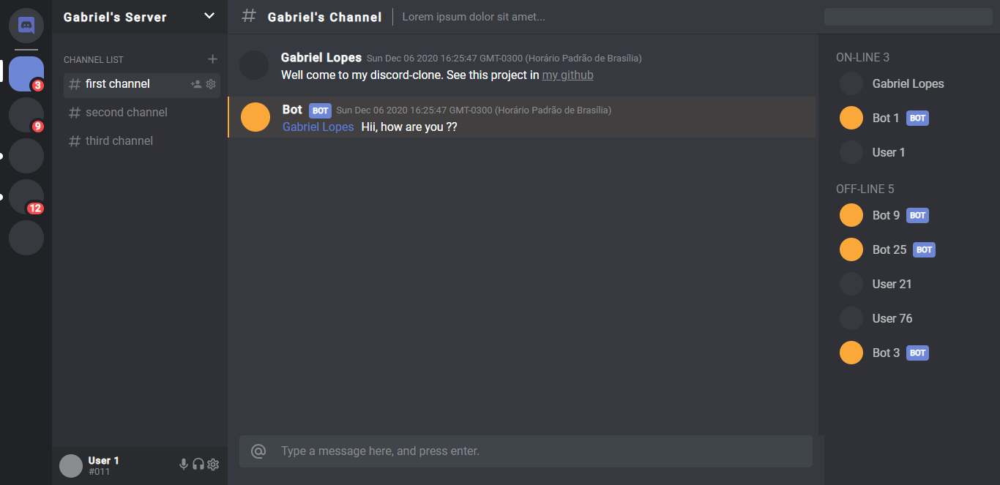

<h1> 
  Discord Clone
  
</h1>

###### Made with: 
<p>  
    
    
  
</p>

## About this project 💻
This is an simple discord interface clone, made with vue.js. This interface don't have any functionality, but i want to tur this project functional, using [Socket.io](https://socket.io/) to create and send messages functionality. I got this idea from the [You tube](https://www.youtube.com/watch?v=E0RwkG3BKvo), so the credits go to the author [Maikel Neris](https://www.youtube.com/channel/UCwwZBOQDEmkWcqs_60NRtMg). However i got this idea from the yt, i did my owns improvements and customization.

###### Project screen:
<p align="center">  
  
</p>

## Building ⚙
You'll need [Node.js](https://nodejs.org) and i recommend that you have installed the [Yarn](https://classic.yarnpkg.com/en/docs/install/#windows-stable) on your computer. After, you can run the scripts below...
```
git clone https://github.com/gabriellopes00/discord-clone.git
cd discord-clone
yarn install
```
```
git clone https://github.com/gabriellopes00/discord-clone.git
cd discord-clone
npm install
```

### Compiles and hot-reloads for development
```
yarn serve
```
```
npm run serve
```

### Compiles and minifies for production
```
yarn build
```
```
npm run build
```

### Possible improvements 🔧
If you want to improve this discord-clone using vue.js, you could work on screen responsiveness when used on mobile devices

## Contact 📱
[](https://github.com/gabriellopes00)
[](https://www.linkedin.com/in/gabriel-lopes-6625631b0/)
[](https://twitter.com/_gabrielllopes_)
[](mailto:gabrielluislopes00@gmail.com)
[](https://www.facebook.com/profile.php?id=100034920821684)
[](https://www.instagram.com/_.gabriellopes/?hl=pt-br)
[](https://stackoverflow.com/users/14099025/gabriel-lopes?tab=profile)

